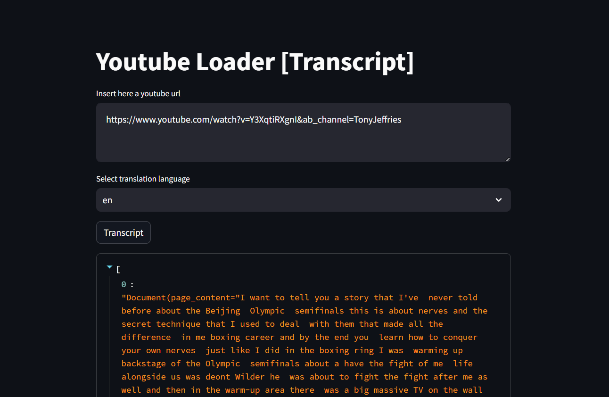

# Youtube Loader [Transcript]
Welcome to Youtube Loader [Transcript], a Python package for extracting transcriptions from YouTube videos! This tool allows you to quickly and easily retrieve transcriptions in different languages, making it convenient for various language processing tasks.

## Features
- Extract transcriptions from YouTube videos.
- Support for multiple languages.
- Simple and easy-to-use interface.

## Set-up
> pip install -r requirements.txt  
> streamlit run gui.py

## Screenshots
