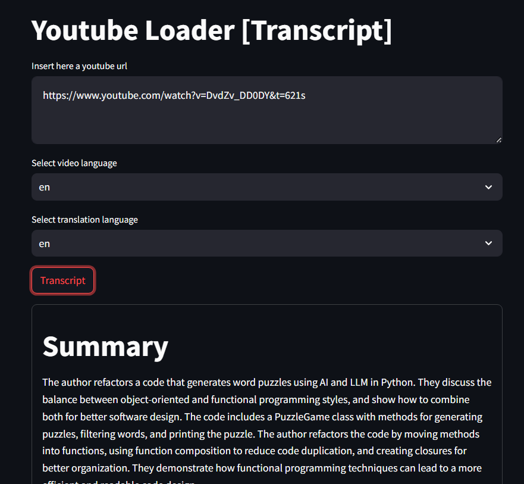
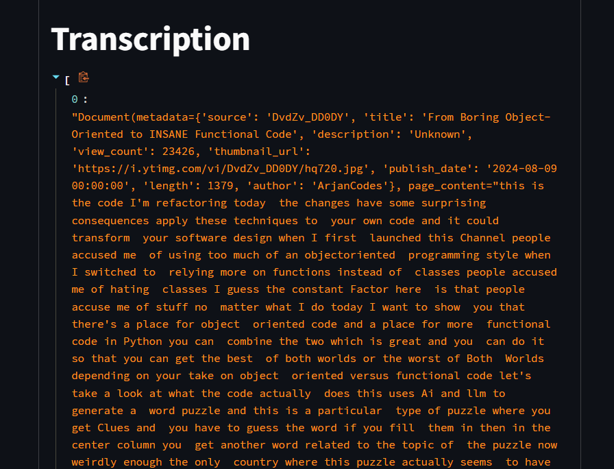

# Youtube Loader [Transcript]
Welcome to Youtube Loader [Transcript], a Python package for extracting transcriptions from YouTube videos! This tool allows you to quickly and easily retrieve transcriptions in different languages, making it convenient for various language processing tasks.

## Features
- Extract transcriptions from YouTube videos (not all languages supported).
- Generate Summary using GenAI model (OpenAI supported)
- Support for multiple languages. (translate a youtube transcription [English and Italian supported])
- Simple and easy-to-use interface.

## Set-up
> pip install -r ./requirements.txt  
> streamlit run ./app/app.py

### Set-up OpenAI
In order to setup the OpenAI model connection:
1. rename the file [.env_sample](.env_sample) into ".env"
2. put your OpenAI API Key inside the OPENAI_API_KEY variable

## Screenshots
Example of summary and transcript generation:  

